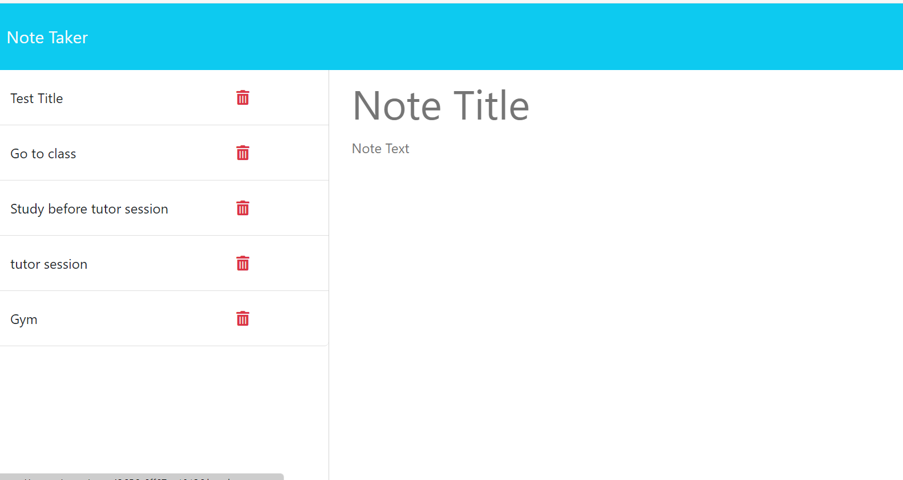

# Express Note Taker

## description
In this assignment I've demonstarted a note taker that allows to write notes and save them. During this assingment its important to understand the concepts api get and post requests and responce. It's important to understand how routes are applied and how it allows data to be retained. Heroku is essential for this assingment in order for this website to operate because it is a full stack exercise.

## application img'

## URL
https://github.com/ShahanAmeen/Express-Notetaker
https://shahanameen.github.io/Express-Notetaker/
## Author
Shahan Ameen
https://github.com/ShahanAmeen 
